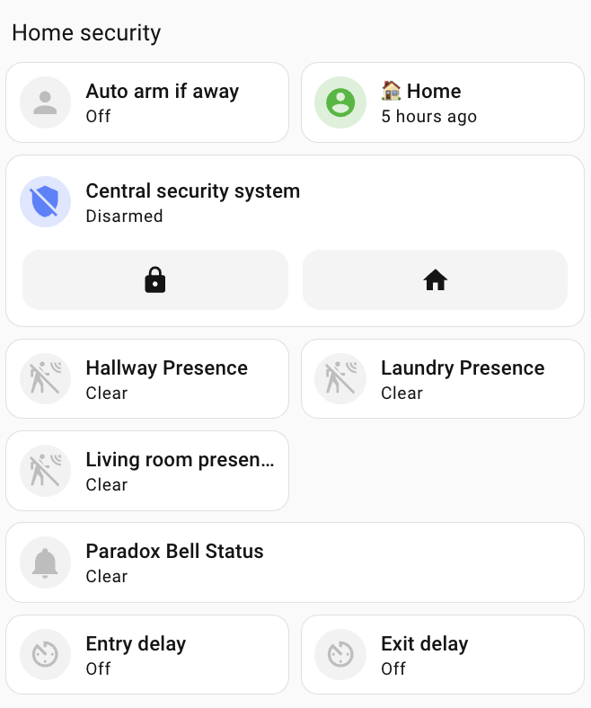
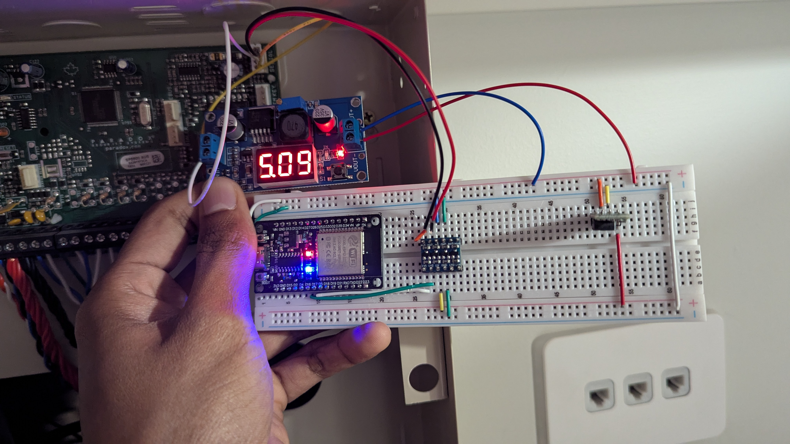
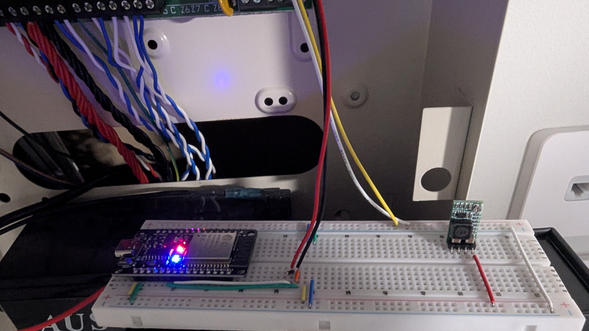
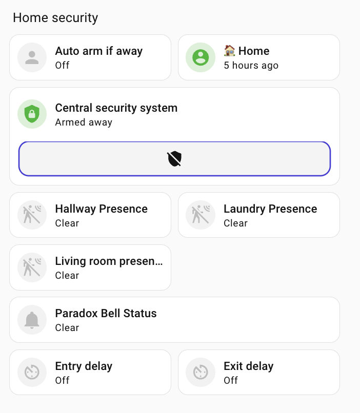
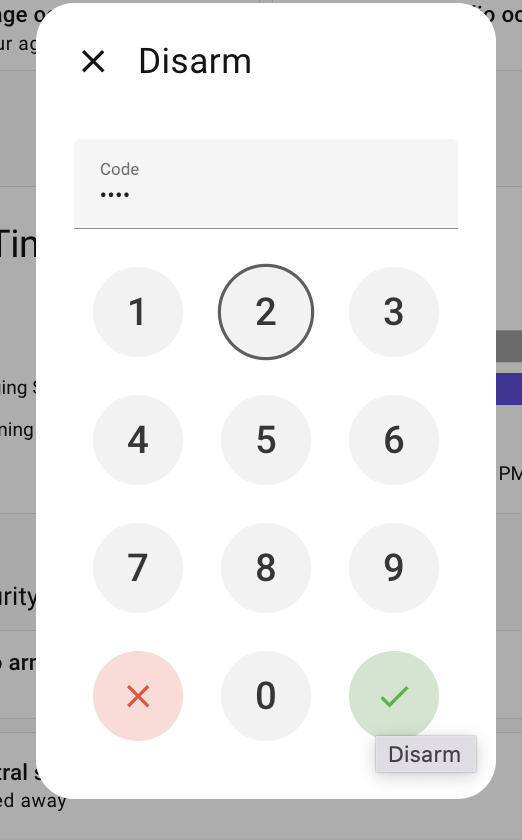
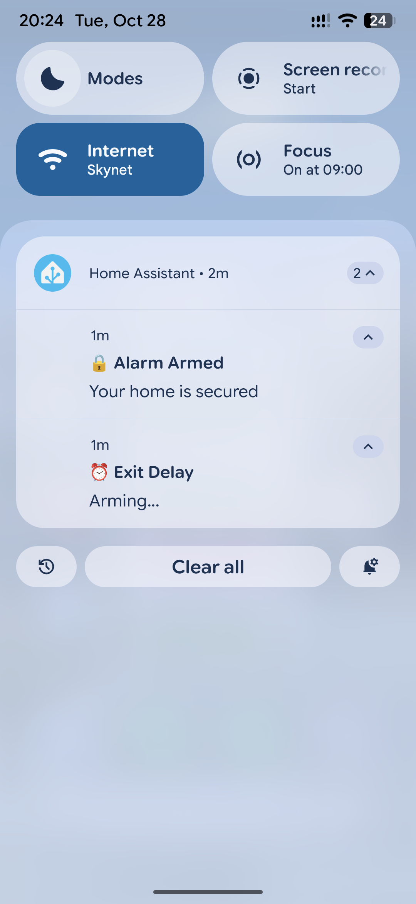

# Paradox MQTT Bridge

An ESP32-based bridge that connects Paradox alarm systems to MQTT, enabling seamless integration with home automation platforms like Home Assistant.



## Features

- **Zero-code WiFi/MQTT configuration** via captive portal
- **Real-time event streaming** from Paradox panel to MQTT
- **Bidirectional control** - arm/disarm/status via MQTT commands
- **Over-the-Air (OTA) updates** - no USB cable required after initial flash
- **Web-based log viewer** - monitor system activity remotely
- **LED status indicators** - visual feedback for connection status
- **Factory reset** - hold boot button for 5 seconds to reconfigure

## Hardware Requirements

- **ESP32 Board**: DOIT ESP32 DEVKIT V1 (or compatible)
- **Alarm Panel**: Paradox SP5500 (tested) or compatible Paradox panels
- **Wiring**: Serial connection to Paradox panel (RX/TX)

### Wiring

> **⚠️** All wire connections you do at your own risk. Improper wiring may damage your equipment/board. Disconnect power before wiring.


**Option 1: With a bi-directional level shifter (Recommended)**

- HV - 5V logic to Paradox system
- LV - 3.3V logic to ESP GPIO/UART



**Option 2: Direct Connection (without Level Shifter)**



#### Wiring Diagram

```
Paradox Panel                                Level Shifter         ESP32
┌──────────┐                                ┌──────────┐          ┌──────────┐
│ Rx       ├────────────────────────────────┤ HV2  LV2 ├──────────┤ GPIO17   │
│          │                                │          │          │ (TX)     │
│ Tx       ├────────────────────────────────┤ HV1  LV1 ├──────────┤ GPIO16   │
│          │                                │          │          │ (RX)     │
│ GND      ├───┬────────────────────────────┤  GND GND ├──────────┤ GND      │
│          │   │                            │          │          │          │
│ AUX+ 12V ├───┼──┐                         │  HV  5V  ├─┐        │          │
│          │   │  │                         │          │ │        │          │
└──────────┘   │  │   Buck Converter        │  LV  3.3V├─┼─┐      │          │
               │  │  ┌──────────┐           └──────────┘ │ │      │          │
               │  └──┤ IN+      │                        │ │      │          │
               │     │          │              ┌─────────┘ │      │          │
               └─────┤ IN-/GND  │              │           └──────┤ 3.3V     │
                     │          │              │                  │          │
                     │  OUT(5V) ├──────────────┴──────────────────┤ VIN      │
                     └──────────┘                                 │          │
                                                                  └──────────┘
```

**Connections summary:**
- Panel AUX+ 12V → Buck converter input
- Buck converter 5V shared to:
  - ESP32 VIN
  - Level shifter HV power
- ESP32 3.3V → Level shifter LV power
- Panel TX → Level shifter HV1 → LV1 → ESP32 GPIO16 (RX)
- ESP32 GPIO17 (TX) → Level shifter LV2 → HV2 → Panel RX
- All grounds connected together

## Installation

### Initial Firmware Flash

1. Install [PlatformIO](https://platformio.org/)
2. Clone this repository:
   ```bash
   git clone https://github.com/komal-SkyNET/paradox32-security-system.git
   cd paradox32-security-system
   ```
3. Connect ESP32 via USB
4. Comment out `upload_port` in `platformio.ini` for first-time serial upload
5. Build and upload:
   ```bash
   pio run -t upload
   ```

### First-Time Setup

1. **Power on** - LED will blink rapidly (setup mode)
2. **Connect** to WiFi network `ParadoxConfig` (password: `paradox123`)
3. **Configure** via captive portal:
   - Select your WiFi network and enter password
   - Enter MQTT broker details (host, port, username, password)
4. **Save** - device reboots and connects automatically

## Configuration

Configuration is stored persistently. To reconfigure:
- **Power cycle** when WiFi is unavailable - portal reopens after 30s
- **Factory reset** - hold BOOT button (GPIO 0) for 5 seconds during operation

### Default Settings

| Parameter | Value |
|-----------|-------|
| Hostname | `paradox-mqtt-bridge.local` |
| Serial Baud Rate | 9600 |
| MQTT Port | 1883 |
| Config Portal SSID | `ParadoxConfig` |
| Config Portal Password | `paradox123` |

## Usage

### LED Status Indicators

| Pattern | Meaning |
|---------|---------|
| Solid ON | Connected (WiFi + MQTT) |
| Slow Blink | WiFi connected, MQTT disconnected |
| Fast Blink | WiFi disconnected / Factory reset pending |
| Quick Flicker | Message transmitted/received |

### MQTT Topics

**Events Published** (panel → MQTT):
```
paradox/events/<EVENT_CODE>
```
Payload: `{"value":"<SUB_EVENT>"}`

Examples:
```
Topic: paradox/events/1
Payload: {"value":"5"}
Description: Zone 5 is open

Topic: paradox/events/2
Payload: {"value":"11"}
Description: Partition disarmed

Topic: paradox/events/2
Payload: {"value":"12"}
Description: Partition armed (away)
```

Common event codes: `0` (zone OK), `1` (zone open), `2` (partition status), `3` (bell status), `36` (zone alarm), `37` (fire alarm)

**For complete event code reference**, see [Deconstructing-events.md](Deconstructing-events.md) which contains comprehensive lookup tables for all event numbers and sub-event payloads.

**Commands Subscribed** (MQTT → panel):
```
paradox/commands
```

### Sending Commands

Commands are sent as JSON payloads to `paradox/commands`:

```bash
mosquitto_pub -h <mqtt_host> -p 1883 -u <user> -P <pass> \
  -t paradox/commands \
  -m '{"command":"arm","partition":0,"password":"1234"}'
```

**Supported Commands:**

| Command | Description | Parameters |
|---------|-------------|------------|
| `arm` | Arm partition (away) | `partition`, `password` |
| `disarm` | Disarm partition | `partition`, `password` |
| `stay` | Arm stay mode | `partition`, `password` |
| `sleep` | Arm sleep mode | `partition`, `password` |
| `status` | Request general status | `password` |
| `status-getzones` | Request zone status | `password` |
| `status-getarmstatus` | Request partition status | `password` |
| `disconnect` | Disconnect from panel | - |

**Parameters:**
- `password`: 4-digit panel password (required for most commands)
- `partition`: Partition number (0-7, default: 0)

## Home Assistant Integration

See `homeassistant/` directory for example configurations:
- `mqtt.yaml` - MQTT sensor/alarm panel definitions
- `template.yaml` - Template sensors for custom event mapping
- `automation.yaml` - Example automations

MQTT sensors map event codes to human-readable states.

### Screenshots

**Alarm Control with PIN Protection**

 

**Push Notifications**



## Development

### Building

```bash
pio run
```

### OTA Upload

```bash
pio run -t upload --upload-port paradox-mqtt-bridge.local
```

### Monitoring

**Web Logs:**
```bash
curl --user ParadoxConfig:paradox123 http://paradox-mqtt-bridge.local/logs
```

**Serial Monitor:**
```bash
pio device monitor
```

### Useful Commands

```bash
pio run -t clean        # Clean build files
pio run -t erase        # Erase ESP32 flash
```

## Architecture

```
Paradox Panel (Serial) ←→ ParadoxHandler
                              ↓
                          Event Decode
                              ↓
                         MqttHandler ←→ MQTT Broker ←→ Home Assistant
                              ↑
                         Command Parse
                              ↑
                      MQTT Commands Topic
```

**Core Components:**
- `ParadoxHandler` - Serial communication and protocol handling
- `MqttHandler` - MQTT pub/sub with auto-reconnect
- `WiFiMqttConfig` - Captive portal configuration manager
- `LedHandler` - Visual status feedback
- `OtaHandler` - Wireless firmware updates
- `WebUi` - HTTP log viewer

## Troubleshooting

| Issue | Solution |
|-------|----------|
| LED blinking fast | Check WiFi credentials via config portal |
| LED blinking slow | Verify MQTT broker is reachable and credentials are correct |
| No events received | Check serial wiring (RX/TX), ensure panel is sending events |
| Can't connect to config portal | Factory reset by holding BOOT button for 5s |
| OTA upload fails | Verify device is on same network, check `paradox-mqtt-bridge.local` resolves |

## Acknowledgments

This project's serial protocol implementation was informed by studying the following open-source projects:

- **[ParadoxMqtt32](https://github.com/maragelis/ParadoxMqtt32)** Provided invaluable reference for understanding the Paradox serial protocol, message structure, and command byte sequences.
- **[ESP32_Paradox_controler_mqtt](https://github.com/zygios/ESP32_Paradox_controler_mqtt)** by zygios - Offered additional protocol insights for SP5500 panel integration.

The code in this repository was independently written but benefited from protocol documentation and implementation patterns found in the above projects. 

## Author

**Komal Venkatesh Ganesan**

If you find this project helpful, consider supporting its development:

<a href="https://www.buymeacoffee.com/komalvenkag" target="_blank"></a>

## License

GNU General Public License v3.0

Copyright (C) 2025 Komal Venkatesh Ganesan

This program is free software: you can redistribute it and/or modify it under the terms of the GNU General Public License as published by the Free Software Foundation, either version 3 of the License, or (at your option) any later version.

This program is distributed in the hope that it will be useful, but WITHOUT ANY WARRANTY; without even the implied warranty of MERCHANTABILITY or FITNESS FOR A PARTICULAR PURPOSE. See the GNU General Public License for more details.

You should have received a copy of the GNU General Public License along with this program. If not, see <https://www.gnu.org/licenses/>.

## Contributing

Contributions are welcome! Please feel free to submit a Pull Request.
